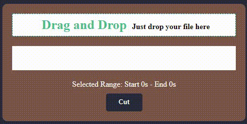

## Audio Cutter

    
    

    document.querySelector('#cut').onclick = function (event) {
        AudioCutter.cut(audio.file, startTime, endTime).then(res => {
            console.log(res)
        }).catch((err) => {
            console.log(err)
        })
    }

    AudioCutter.run(document.querySelector('.waveform'), audio.blob, {
        waveColor: '#FFAA00',
        backgroundMask: 'rgba(232,109,109,0.42)',
        playAfterCut: false,
        isDownload: true,
        name: 'download.wav',
        callBack: (start, end) => {
            startTime = start;
            endTime = end;

            selectInfo.innerText = `Selected Range: Start ${startTime.toFixed(2)}s - End ${endTime.toFixed(2)}s`;
        }
    });
    
  
